# Node.js — Fundamentals

> Notes from AlgoCamp · Topics: Runtime, Package Management, Versioning, Environment Variables

---

## 1. What is Node.js?

JavaScript originally only ran inside browsers. Node.js is a **runtime environment** that takes JS outside the browser and runs it directly on a machine.

> Created in **2009 by Ryan Dahl** as an open source project.

### Browser JS vs Node.js

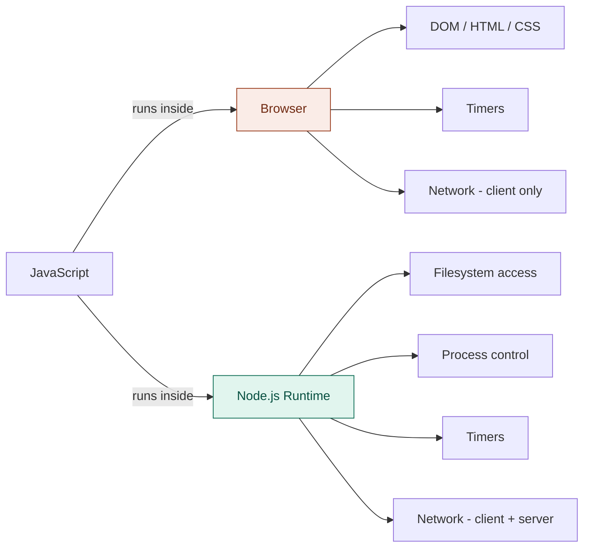

### Node.js Internal Architecture

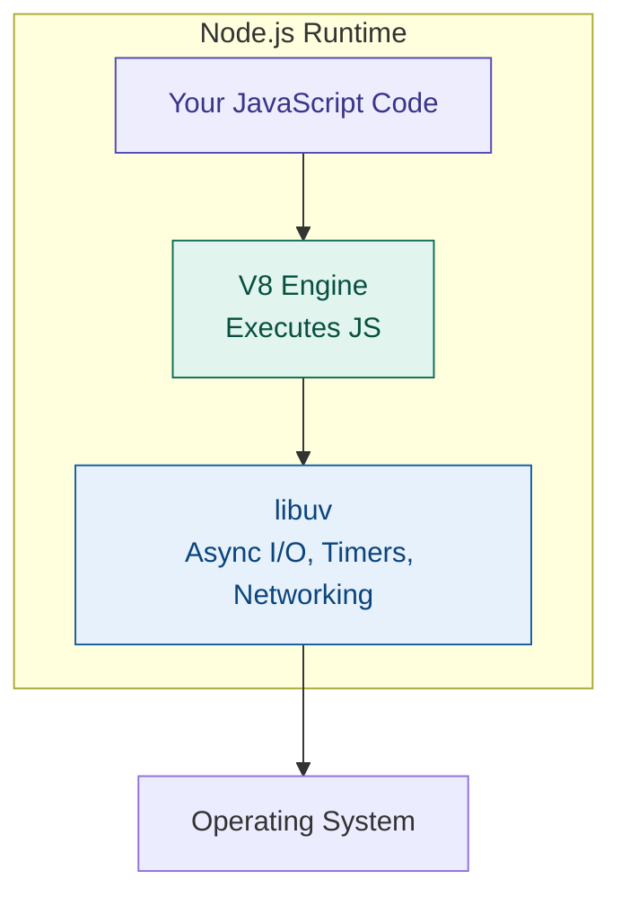

---

## 2. REPL

Node.js ships with a **REPL** console — an interactive shell to run JS code directly.

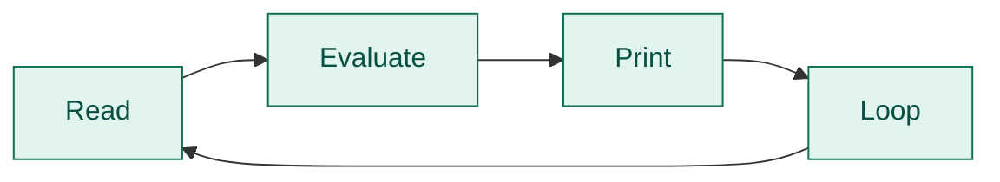

Run it by typing `node` in your terminal.

---

## 3. Package Management

### Key Terms

|Term|Meaning|
|---|---|
|**Package**|A pre-written piece of code intended to do a specific task|
|**Library**|A package that does one focused thing|
|**Framework**|A collection of libraries that form a complete ecosystem|

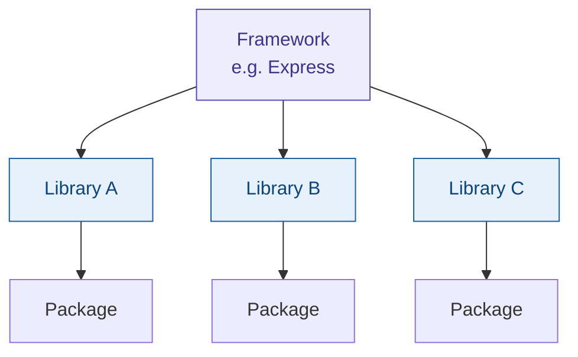

### Package Managers

- **NPM** — Node Package Manager (default, comes with Node.js)
- **PNPM** — saves disk space by using symlinks instead of copying packages per project
- **Yarn** — another alternative

### Setting Up a Project

```bash
npm init     # creates package.json
pnpm init    # same, using pnpm
```

---

## 4. `package.json`

The metadata file for your project.

```json
{
  "name": "my-app",
  "version": "1.0.0",
  "main": "index.js",
  "scripts": {
    "dev": "node --watch index.js"
  },
  "dependencies": {
    "axios": "^1.16.0",
    "dotenv": "~17.4.2"
  }
}
```

**Key fields:**

- `scripts` — alias long commands, run with `npm run <name>`
- `dependencies` — packages your project needs
- `main` — entry point file

### Hot Reloading

The `--watch` flag (built into modern Node.js) auto-restarts when a file changes. Previously needed the external package `nodemon`.

---

## 5. Dependency Graph

When you install a package, it may depend on other packages — which depend on more. NPM/PNPM resolves and downloads the **entire graph** automatically.

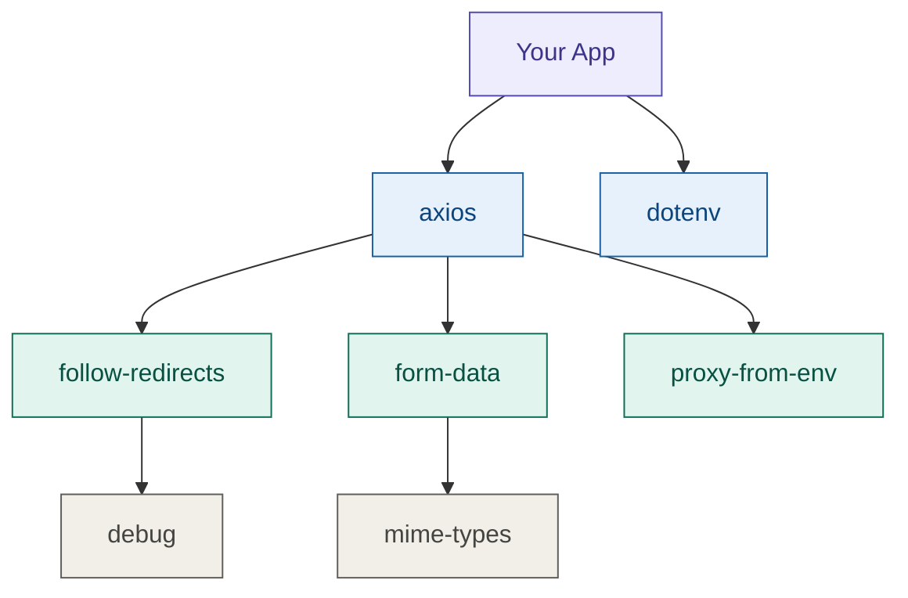

---

## 6. Lock Files

|File|Created by|
|---|---|
|`package-lock.json`|npm|
|`pnpm-lock.yaml`|pnpm|

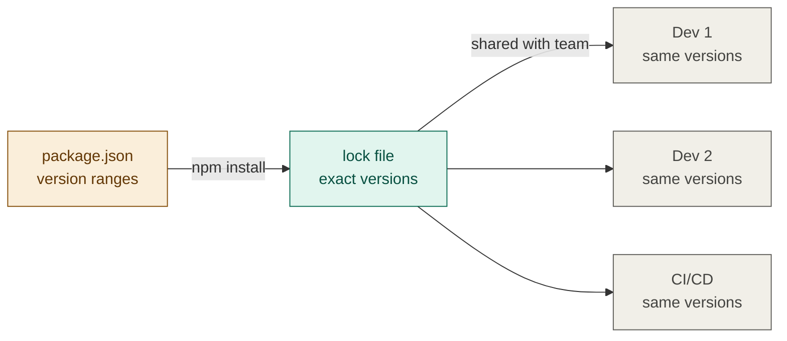

**Why important:** Ensures every team member and deployment gets the exact same versions. Prevents "works on my machine" bugs.

---

## 7. Version Numbers — `major.minor.patch`

```
1  .  16  .  0
↑      ↑     ↑
major minor patch
```

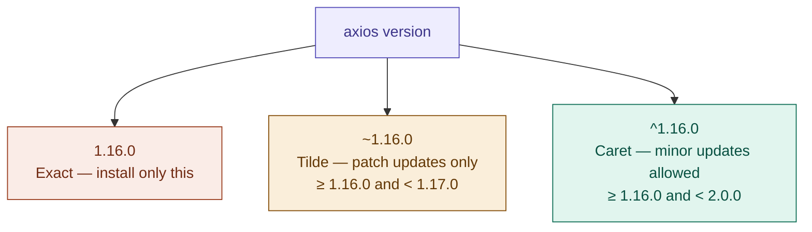

> **Rule of thumb:** Use `^` for most packages. Use exact versions when stability is critical.

---

## 8. Data Formats — XML vs JSON vs YAML

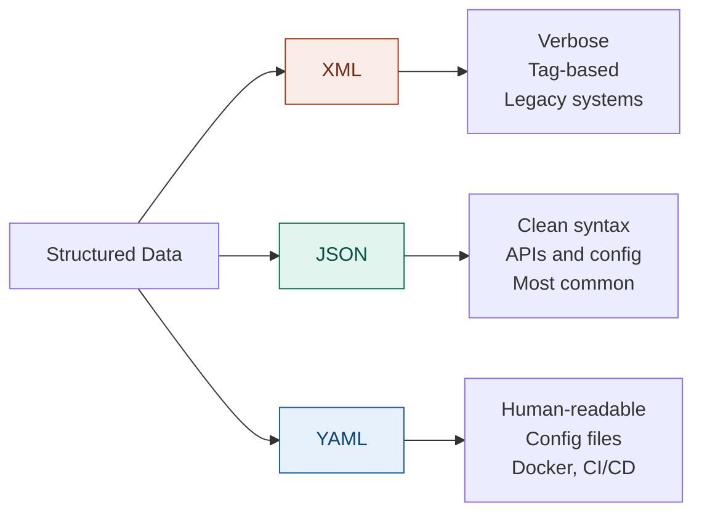

**Same data, three formats:**

```xml
<!-- XML -->
<Product>
  <name>Iphone</name>
  <price>50000</price>
</Product>
```

```json
// JSON
{ "product": { "name": "Iphone", "price": 50000 } }
```

```yaml
# YAML
- name: "Iphone"
  price: 50000
  currency: [USD, INR]
```

---

## 9. Node.js Globals

Node provides global variables automatically — just like how browsers provide `document` or `window`.

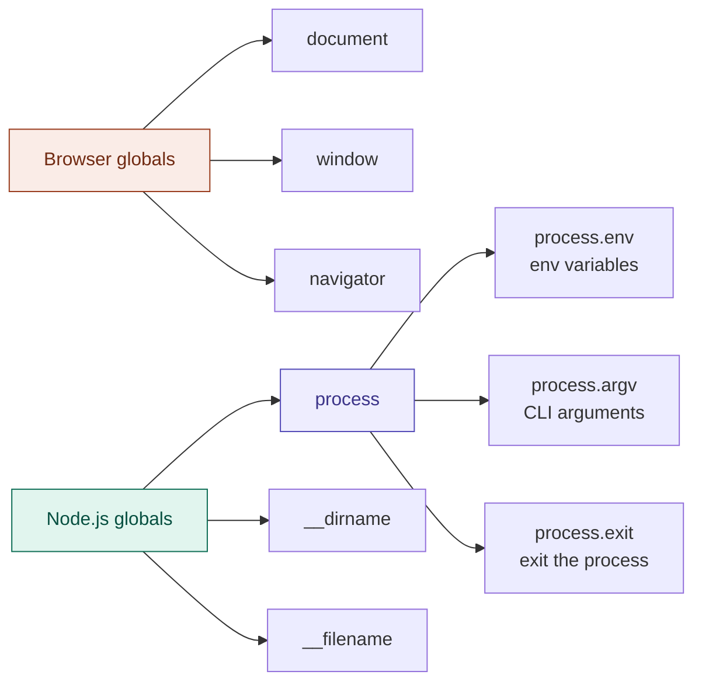

---

## 10. Environment Variables

**What:** Key-value pairs stored at the OS level. Any process on the machine can read them.

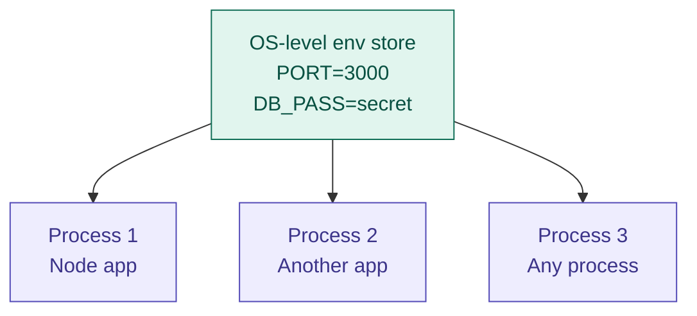

**Why use them:**

- Store sensitive info (API keys, DB passwords) outside your code
- Share common config across multiple processes

### How to Set Them

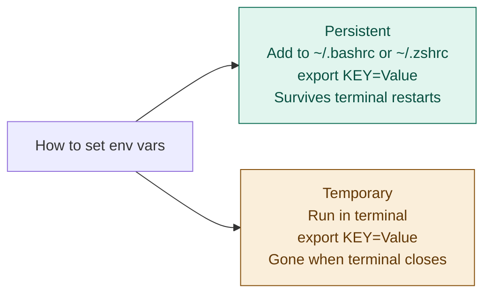

### Access in Node.js

```js
process.env.PORT        // reads the PORT env variable
process.env.DB_PASSWORD // reads a DB password
```

---

## Quick Reference

```bash
node                    # open REPL
node index.js           # run a file
node --watch index.js   # run with hot reload

npm init                # create package.json
npm install             # install all dependencies
npm run dev             # run the "dev" script
```