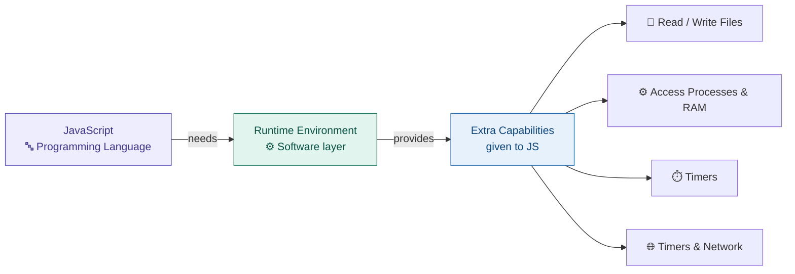
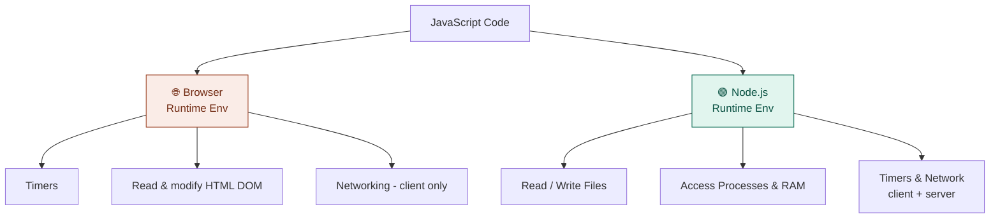
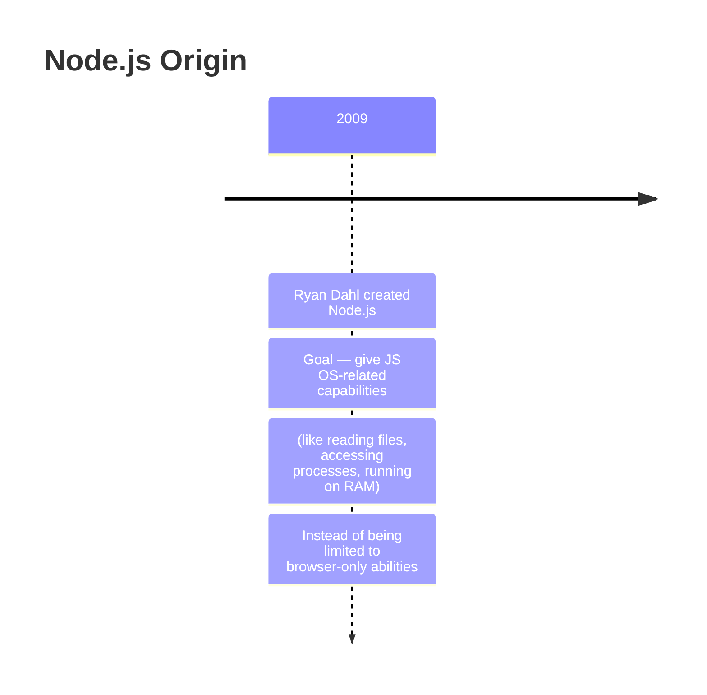
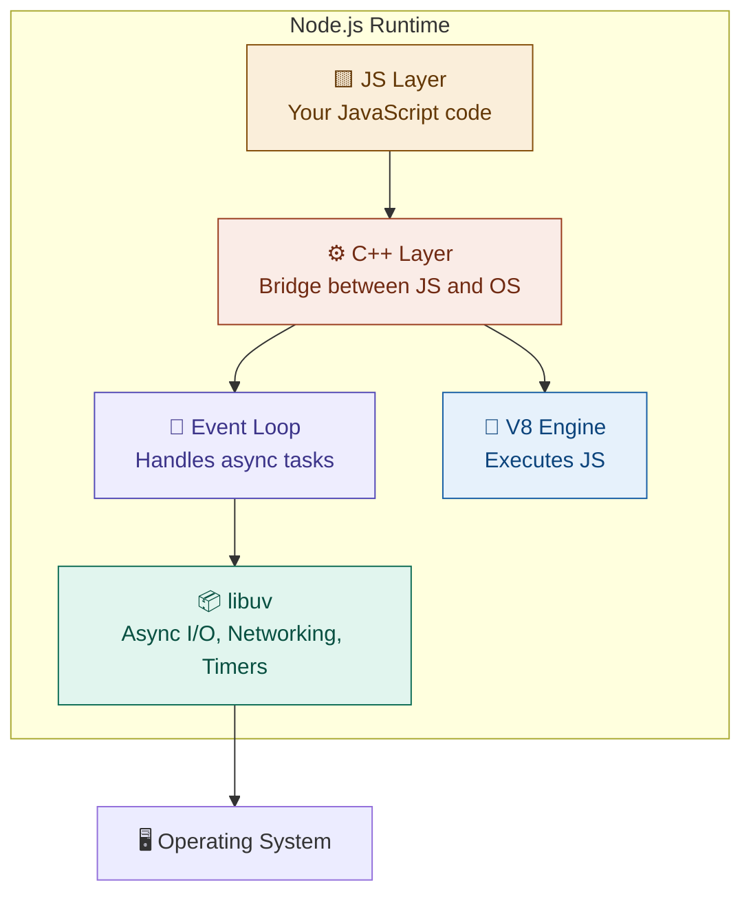
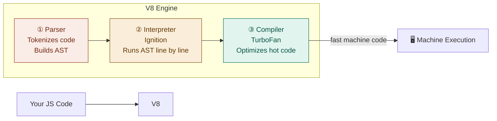
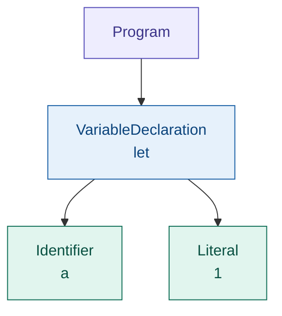
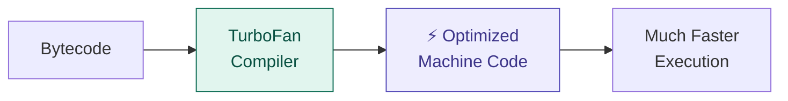
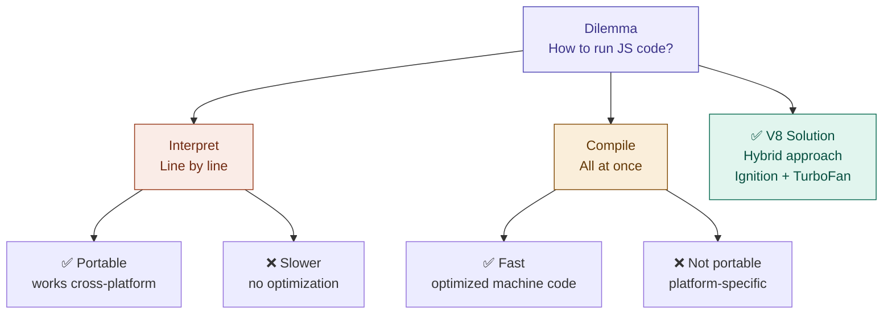
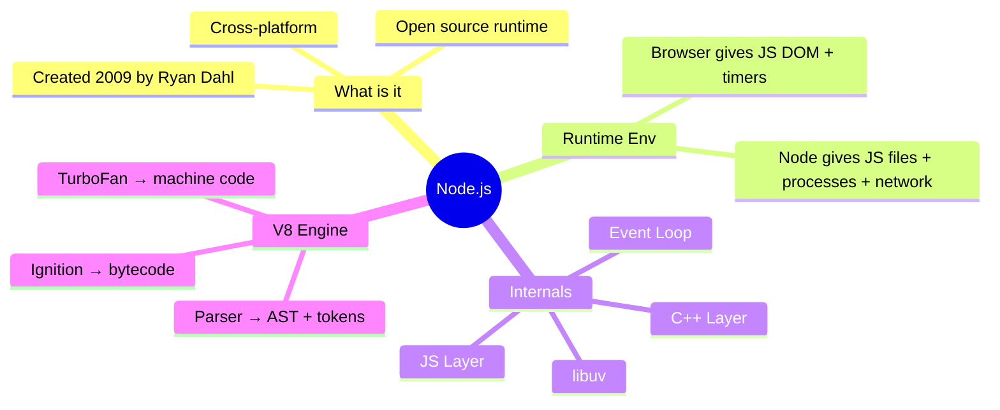

# Node.js Internals & V8 Engine

> Handwritten notes — cleaned and structured with diagrams

---

## 1. What is Node.js?

**Node** is an **open source**, **cross-platform** runtime environment.

> 📌 Cross-platform = runs on Windows, Mac, Linux



---

## 2. What is a Runtime Environment?

> **Runtime Env** = a **software** that provides **extra capabilities** to JS

- JS is just a programming language — it has no power on its own
- A runtime environment wraps JS and gives it abilities

### Two Runtime Environments for JS



> 💡 Browser is **also** a runtime env — it provides timers, reading and modifying HTML to JS.

---

## 3. History — Why Node.js was Created?



**Ryan Dahl's idea:**

- JS was stuck inside the browser
- He wanted JS to also work **outside the browser** — on servers and machines
- So he built Node.js, giving JS: read/write files, access processes, timers, networking

---

## 4. Internals of Node.js

Node.js is not magic — it is built from layers:



### The Layers Explained

|Layer|What it does|
|---|---|
|**JS Layer**|Your code — written in JavaScript|
|**C++ Layer**|Translates JS calls into system-level operations|
|**V8 Engine**|Executes and compiles JS into machine code|
|**Event Loop**|Manages async tasks (timers, I/O callbacks)|
|**libuv**|Handles file system, networking, timers at OS level|

---

## 5. V8 Engine — Deep Dive

> V8 is a **JS engine** — it makes running JS code possible on a machine. V8 is majorly written in **C++**.



### Components of V8 Engine

#### ① Parser

- Takes raw JS code
- **Tokenizes** it (breaks into small pieces)
- Builds an **AST** (Abstract Syntax Tree)

**Example — Tokenization:**

```
let a = 1;
→ [ let, a, =, 1, ; ]
```

**AST = Abstract Syntax Tree**



> 💡 **Why is a Parser needed?** Computers don't understand JS directly. The parser converts human-readable code into a structured tree that the engine can process step by step.

---

#### ② Interpreter — Ignition

- Takes the AST produced by the parser
- Converts it to **bytecode**
- Runs code **line by line** (portable, cross-platform)


> 📌 Bytecode is **portable** — can run cross-platform (Windows, Mac, Linux)

---

#### ③ Compiler — TurboFan

- Watches for **"hot" code** (functions called many times)
- Compiles hot code into optimized **machine code**
- Makes repeated execution much faster



---

### Full V8 Pipeline — Summary


---

## 6. The Interpret vs Compile Dilemma

Running JS involves a classic trade-off:



> V8 **combines both** — interpret first for portability, then compile hot paths for speed.

---

## Quick Summary

